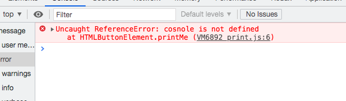
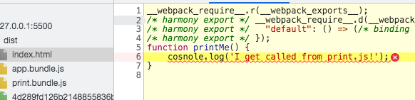
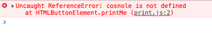
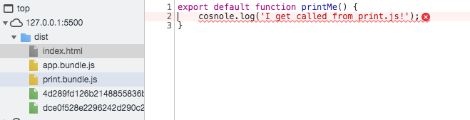
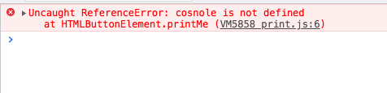
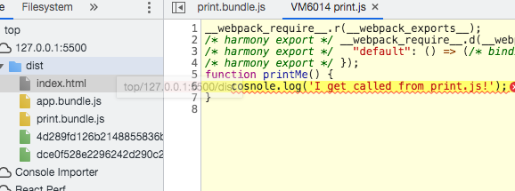
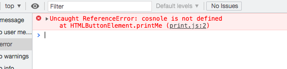
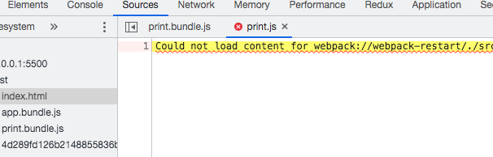

[指南](https://v4.webpack.docschina.org/guides/getting-started/)

[webpack5发布指南](https://webpack.docschina.org/blog/2020-10-10-webpack-5-release/)

[从 v4 升级到 v5](https://webpack.docschina.org/migrate/5/)

# 1.webpack安装

* webpack4+中webpack和webpack-cli两个包分开，需要都安装
* 可以通过移除package.json中的main来防止意外发布你的代码
* Package.json中增加`private:true`，确保[安装包是私有的](https://v4.webpack.docschina.org/guides/getting-started/)？
* npm文档[package-json](https://docs.npmjs.com/cli/v7/configuring-npm/package-json)
* 没有webpack.config.js配置时，使用`npx webpack`会将我们的脚本 `src/index.js` 作为 [入口起点](https://v4.webpack.docschina.org/concepts/entry-points)，也会生成 `dist/main.js` 作为 [输出](https://v4.webpack.docschina.org/concepts/output)

# 2.资源管理

* 加载css：

  ```bash
  npm install --save-dev style-loader css-loader
  ```

  ```js
   module: {
     rules: [
       {
         test: /\.css$/,
         use: [
           'style-loader',
           'css-loader'
         ]
       }
     ]
   }
  ```

  css相关的loader：postcss、sass、less
  
* 加载images图像

  ```bash
  npm install --save-dev file-loader url-loader
  ```

  ```js
  {
      test: /\.(png|svg|jpg|gif)$/,
      use: ['file-loader']
  }
  ```

  file-loader将图片处理，在 `import MyImage from './my-image.png'` 时，此图像将被处理并添加到 `output` 目录，_并且_ `MyImage` 变量将包含该图像在处理后的最终 url；css-loader会处理css中的url('./my-image.png')；html-loader会处理html中的``

  使用`url-loader`和`file-loader`可以接收并加载任何文件，将其输出(copy)到构建目录；`url-loader`依赖于`file-loader`

  在图片很多的情况下，就会发起很多的http请求，会降低页面性能；`url-loader`此时就比较优秀，其可以将较小的图片转成base64成为dataURL，从而减少网络请求次数；url-loader配置中有一个配置项limit，当小于这个值时使用url-loader转成base64，当图片大于这个值时，调用file-loader处理图片

  ```js
  {
    test: [/\.bmp$/, /\.gif$/, /\.jpe?g$/, /\.png$/],
    loader:'url-loader',
    options: {
      esModule: false, // 使用ES模块语法的JS模块
      limit: 10000,
      name: `${staticName}/media/[name].[hash:8].[ext]`,
      encoding:'base64', // 默认；指定文件内联的编码
      fallback:'file-loader', // 默认；指定当目标文件的大小超过限制选项中设置的限制时使用的替代加载程序。
    },
  },
  ```

* 特殊处理svg

  [url-loader npm中的例子](https://www.npmjs.com/package/url-loader#encoding)：

  SVG can be compressed into a more compact output, avoiding `base64`. You can read about it more [here](https://css-tricks.com/probably-dont-base64-svg/). You can do it using [mini-svg-data-uri](https://github.com/tigt/mini-svg-data-uri) package.

  ```js
  const svgToMiniDataURI = require('mini-svg-data-uri');
  
  {
    test: /\.svg$/i,
      use: [
        {
          loader: 'url-loader',
          options: {
            generator: (content) => svgToMiniDataURI(content.toString()),
          },
        },
      ],
  }
  ```

* 加载fonts字体

  使用`file-loader`即可：

  ```js
  {
      test: /\.(woff|woff2|eot|ttf|otf)$/,
      use: [
      'file-loader'
      ]
  }
  ```

* 加载数据

  默认内置了支持JSON；

  csv或tsv可以使用csv-loader；

  xml可以使用xml-loader；

  ```js
  {
    test: /\.(csv|tsv)$/,
      use: [
        'csv-loader'
      ]
  },
    {
      test: /\.xml$/,
        use: [
          'xml-loader'
        ]
    }
  ```

  [*在使用* [d3](https://github.com/d3) *等工具实现某些数据可视化时，这个功能极其有用。可以不用在运行时再去发送一个 ajax 请求获取和解析数据，而是在构建过程中将其提前加载到模块中，以便浏览器加载模块后，直接就可以访问解析过的数据。*](https://v4.webpack.docschina.org/guides/asset-management)?

  # 3.管理输出

  ```js
  // 单个输入
  entry:'./src/index.js',
  // 多个输入
  entry:{
    app: './src/index.js',
    print: './src/print.js'
  },
  ```

  使用HtmlWebpackPlugin（html-webpack-plugin）将生成一个包含正确output的文件名的index.html；还有一些其他用于html中的配置可以参考[github html-webpack-plugin](https://github.com/jaketrent/html-webpack-template)

  清理dist下的之前的文件使用clean-webpack-plugin插件;

  ```js
  const HtmlWebpackPlugin = require('html-webpack-plugin');
  const {CleanWebpackPlugin} = require('clean-webpack-plugin');
  plugins: [
      new CleanWebpackPlugin(),
      new HtmlWebpackPlugin({
          title: '管理输出'
      })
  ],
  ```

  webpack 和 webpack 插件似乎“知道”应该哪些文件生成。答案是，webpack 通过 [manifest](https://v4.webpack.docschina.org/concepts/manifest)，可以追踪所有模块到输出 bundle 之间的映射；后续继续研究[manifest](https://v4.webpack.docschina.org/concepts/manifest)——当 compiler 开始执行、解析和映射应用程序时，它会保留所有模块的详细要点。这个数据集合称为 "manifest"，当完成打包并发送到浏览器时，runtime 会通过 manifest 来解析和加载模块。无论你选择哪种 [模块语法](https://v4.webpack.docschina.org/api/module-methods)，那些 `import` 或 `require` 语句现在都已经转换为 `__webpack_require__` 方法，此方法指向模块标识符(module identifier)。通过使用 manifest 中的数据，runtime 将能够检索这些标识符，找出每个标识符背后对应的模块。

  # 4.开发环境

  ## 4.1 source-map

  [devtool文档](https://v4.webpack.docschina.org/configuration/devtool)

  ```js
  // print.js
  export default function printMe() {
      cosnole.log('I get called from print.js!');
  }
  ```

  * 不设置

    

    

  * `devtool: 'inline-source-map',`

  

  ​	

  

  * `devtool: 'eval',`

  

  

  * `devtool:'nosources-source-map'`

    

    ​	

## 4.2 使用watch模式

```json
 "watch": "webpack --watch",
```

官网上说其有缺点——[唯一的缺点是，为了看到修改后的实际效果，你需要刷新浏览器。如果能够自动刷新浏览器就更好了，因此接下来我们会尝试通过 `webpack-dev-server` 实现此功能。](https://v4.webpack.docschina.org/guides/development/#%E4%BD%BF%E7%94%A8-watch-mode-%E8%A7%82%E5%AF%9F%E6%A8%A1%E5%BC%8F-)

但是我在实际测试中，修改一个代码，然后点击保存浏览器上立马就发生变化了——oh，我明白了，因为我使用vscode的live-server起了一个本地server，所以及时更新了浏览器；

## 4.3 webapck-dev-sever

